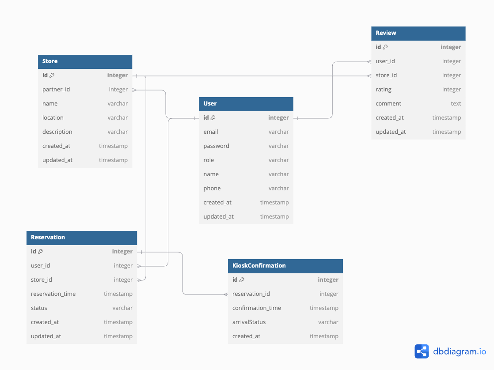

# 매장 테이블 예약 서비스

매장 방문 시 미리 방문 예약을 진행하는 서비스입니다.

---

## 🗒️ ERD

---

## 🚀 주요 기능

- 회원 가입 기능(매장 점장 및 사용자)
- 매장 등록/수정/삭제 기능
- 예약 진행(예약 가능 여부 확인 후 예약 진행)
- 도착 확인 기능
- 예약 이용 후 리뷰 작성 기능(예약자인지 확인 후 작성/수정/삭제)

---

## 🛠️ 기술 스택

- **Backend**: Spring Boot, Java
- **Database**: MySQL
- **Build Tool**: Gradle
- **API Documentation**: Swagger